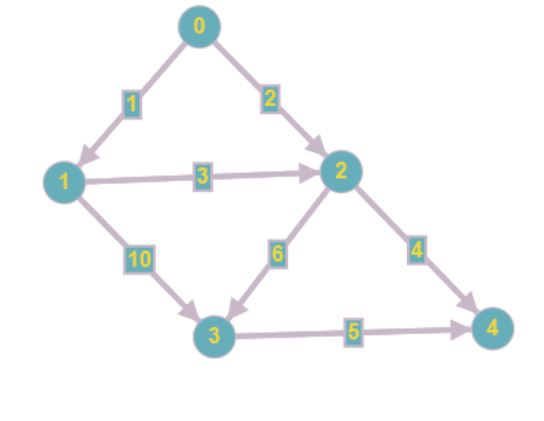

# magicGraphs
## текущие задачи
* [X] научиться рисовать графы  
* [X] рисовать поиск в глубину  
* [ ] рисовать поиск в ширину

##
**Параметры запуска**:  
```[undirected\directed] [filename] [DFS\BFS]```  

```[undirected\directed]``` : тип графа (ориентированный или неориентированный соотвественно)  
```[filename]``` : имя файла, задающего граф  
```[DFS\BFS]``` : алгоритм для визуализации (пока доступны только поиски в глубину и ширину)

*(пока так, но потом добавится возможность визуализации алгоритмов поиска кратчайшего пути и, может быть, построения минимального остовного дерева. также добавится параметр, указывающий имя директории, куда необходимо сохранить gif полученного результата)*

# Отчет
## Организационный этап

В ходе организационного этапа нами была проанализирована графовая база данных neo4j (добавить ньюансы), которая является одной из самых зрелых и полнофункциональных графовых баз данных на сегодняшний день. Графовые базы данных отлично подходят к задаче моделирования данных с той точки зрения, что многие вещи действительно могут быть представлены как набор вершин и связей между ними, называемых ребрами. Анализ внутреннего устройства neo4j и алгоритмов, уже реализованных на этой базе, был полезен для нашего проекта и, в частности, продумывания его архитектуры.  
Алгоритмическая база нашего проекта была сконструирована в ходе анализа книги «Дискретная математика: графы, матроиды, алгоритмы» Асанов М. О., Баранский В. А,   Расин В. В. Идеи реализации некоторых алгоритмов проекта были заимствованы именно из этого ресурса, например, алгоритм построения Эйлерова цикла или алгоритм MAXMIN пути.  
В ходе анализа всех материалов постепенно был составлен план проекта и определены стадии его разработки, а также установлены дедлайны на выполнение ключевых задач. Подробности были освещены на странице проекта в README.md репозитория на github.com. 
	
### Основной этап
Основной этап работы над проектом был разделен на несколько частей:
  
	1. Создание необходимой архитектуры, обеспечивающей удобную работу с графами
	2. Написание базы алгоритмов проекта
	3. Тестирование алгоритмов и создание тестовой базы графов
	4. Добавление визуализации

Создание необходимой архитектуры, обеспечивающей удобную работу с графами, был завершен в первые недели работы над проектом. Был написан пакет graph, включающий в себя все необходимые классы, определяющие функциональность. 
Этот пакет содержал класс Graph, с использованием экземпляров которого в дальнейшем и реализовывались запланированные алгоритмы. Конструкторы класса определены двумя способами: создание графа с помощью матрицы смежности и создание графа путем передачи количества его вершин и количества его ребер. Также в Graph были добавлены методы, позволяющие получить список смежности из матрицы смежности и добавить матрицу весов графа.  
Внутри Graph содержал экземпляры класса Edge в качестве поля. Необходимо было выделить ребро как самостоятельный класс, чтобы сохранить логику создания самого графа (ведь это, по определению, множество ребер и множество вершин). Ребро может быть задано не только, как пара вершин, представленных как source и destination, но и как тройка значений, включающих вес ребра. Здесь же предусмотрен механизм сравнения ребер: написан compareTo(), производящий сравнение ребер по их весам, а также написан equals(), опреедляющий, являются ли ребра одинаковыми, или нет (одинаковыми ребра считаются в том и только в том случае, если у нах совпадает наччальная вершина, конечная вершина и вес).  
Поскольку для реализации алгоритмов важно знать каким именно является граф (ориентированный или неориентированный) было создано два класса DirectedGraph и UndirectedGraph, расширяющих вышеописанный класс Graph. Этот шаг сделал работу с графами еще более простой.  

Затем начался второй этап работы, который продлился практически месяц: написание базы алгоритмов. В проекте было решено реализовать следующие алгоритмы: 
	
	1. Поиск в ширину
	2. Поиск в глубину
	3. Проверка на двудольность
	4. Поиск компонент связности
	5. Поиск цикла
	6. Нахождение Эйлерова пути
	7. Построение Гамильтонова цикла
	8. Алгоритм Дейкстры
	9. Алгоритм Беллмана-Форда
	10. Раскраска графа
	11. Построение maxminпути
	12. Топологическая сортировка
	13. Поиск кратчайшего пути в топологически отсортированном графе
	14. Построение минимального остова (Краскал)
	15. Построение минимального остова (Борувка)
	16. Построение минимального остова (Прим)

Каждый из этих алгоритмов был реализован в пакете algorithms с использованием вышеупомянутых классов из пакета graph. 

## Тестирование
На все алгоритмы написаны модульные тесты и составлена база графов (все тестовые файлы с графами можно найти в ```resources```).  
Тестирование поисков в глубину и ширину заключалось в проверки работоспособности соответствующих алгоритмов на ориентированных и неориентированных взвешенных\невзвешенных графах.  
Тестирование алгоритмов поиска кратчайших путей (алгоритм Дейсктры и Беллмана-Форда) проводилось аналогично, но с появлением отрицательных весов в графах во втором случае.  
Тестирование алгоритма поиска компонент связности графа проводилось также на всевозможных случаях: когда существует лишь одна компонента связности, состоящая из всех вершин графа, когда существует несколько компонент связности, различных по размеру, когда существует количество компонент связности, равное количеству вершин графа, и каждая компонента представляет собой вершину.  
Тестирование алгоритма раскраски графа было проведено для случаев графа, содержащейго изолированные вершины, грава, состоящего только из изолированных вершин, и графа, без изолированных вершин.  
Тестирование алгоритмов на построение минимального остовного дерева (алгоритм Краскала, алгоритм Прима, алгоритм Борувки) заключалось в проверке на равенство соответсвующих ребер минимального остовного дерева, полученного с помощью алгоритмов.  
Тестирование алгоритма топологической сортировки было проведено для графов, имеющих изолированные вершины, а также для связных графов.  
Тестирование алгоритма поиска циклов в графе заключалось в проверке роботоспособности алгоритма в случае ориентированного и неориентированного графа.  
Тестирование алгоритма на нахождение Эйлерова пути было проведено на графах, его не имеющих.  
Тестирование алгоритма на поиск Гамильтонова цикла включало случаи простого цикла (когда все ребра образуют единый цикл), графа, имеющего цикл (существуют ребра, не входящие в цикл) и графа, не имеющего цикла вовсе.  


Реализован протокол хранения графа в формате txt.

**Протокол хранения графа:**  
В первой строке указывается количество вершина графа.  
Последующие строки вида:  
```<вершина, из которой ребро исходит> <вершина, в которую ребро входит> <вес ребра (если граф невзвешенный, заполнить все поля веса нулями)>```  
*Пример графа, представленного в соответствии с протоколом:*  

	5
	0 1 1
	0 2 2
	1 2 3
	1 3 10
	2 3 6
	2 4 4
	3 4 5

 

## Визуализация
  * красивые картинки, гифки
	
